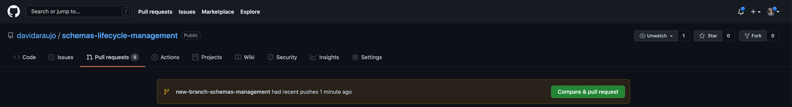
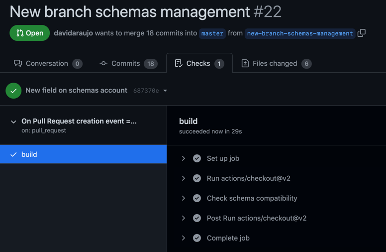
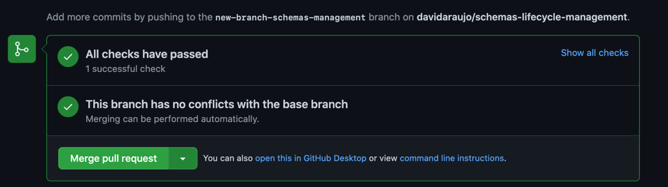

# Schema as code 
## A CI/CD pipeline for managing schemas on the Confluent Schema Registry using GitHub Actions workflow

For this project we are going to use GitHub workflows to run actions triggered by events in our schemas lifecycle, in particular:
* Run action **check schema compatibility** when a Pull Request is created to merge a new schema to master.
* Run action **register schema** when a Pull Request is approved and merged to master.

Steps to manage schemas from development to depoyment on the Confluent Schema Registry:
1. Create a new branch for your work: `git checkout -b [Branch Name]`.
2. Make changes by updating an existing schema or creating a new one under the `src/main/schemas` folder. 
3. Add the changes to your branch: ``git add .``.
4. Commit the changes: ``git commit -m "New field on schemas xpto..."``.
5. Push the new branch to your remote: ``git push origin [Branch Name]``.
6. Login to your GibHub remote, e.g. ``https://github.com/davidaraujo/schemas-lifecycle-management/pulls``, and check your new branch available for Pull Request:


7. Click "Compare & pull request" to create a Pull Request.
8. At this point the workflow in `.github/workflows/schema-ci-cd-on-pull-request.yml` will run the action to check schema compatibility and only if succeed will it create a new Pull Request:
```
...
run: mvn schema-registry:test-compatibility --file pom.xml
...
```
9. If compatibility checking passes a new Pull Request is created for approval:


10. Final step is to approve the Pull Request and merge the changes to master:


11. At this point the workflow in `.github/workflows/schema-ci-cd-on-merge.yml` will run the action to register the new schema on the Confluent Schema Registry:
```
...
run: mvn schema-registry:register --file pom.xml
...
```
12. All done, your new schemas is now live on the Confluent Schema Registry! 


GitHub actions workflow reference: https://docs.github.com/en/actions/learn-github-actions/understanding-github-actions
